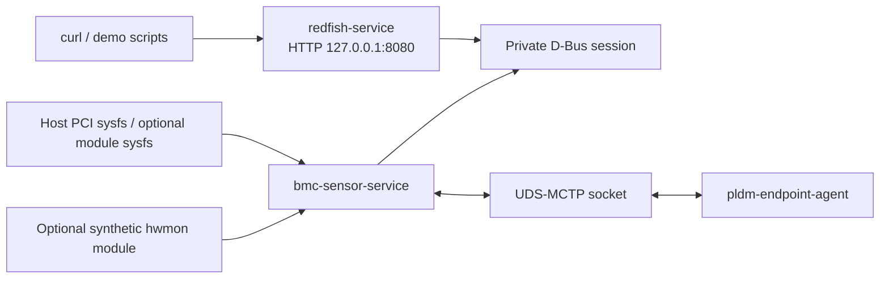

# Mini OpenBMC Platform Management Service

這個 repository 提供可在一般 Linux 主機執行的平台管理服務原型。程式以私有
D-Bus Session Bus 串接感測器服務與 HTTP API，並用 Unix Domain Socket
（UDS）模擬 MCTP 傳輸及 PLDM endpoint。另有兩個選用的 Linux Kernel Module，
用來提供合成的 PCIe telemetry 與 hwmon 資料。

專案名稱沿用 OpenBMC、Redfish、MCTP 與 PLDM 的術語，但目前實作是本
repository 內部使用的精簡子集，不宣告符合 OpenBMC 發行版、DMTF Redfish
Conformance 或 DMTF PLDM wire-format interoperability。

## 功能範圍

目前可執行的功能如下：

| 功能 | 實作位置 | 驗證方式 |
| --- | --- | --- |
| 三個使用者空間程序的啟動與停止 | `scripts/run_session.sh`、`services/` | `scripts/smoke_test.sh` |
| 私有 D-Bus service、物件與屬性更新 | `libs/dbus/` | `tools/dbus_dump.cpp`、`test/test_dbus_mapping.cpp` |
| 感測器輪詢、門檻判斷與事件建立 | `services/bmc-sensor-service/`、`libs/sensor/` | `test/test_threshold_event_engine.cpp` |
| Redfish 風格的 HTTP GET 路由 | `services/redfish-service/` | `scripts/demo_redfish_sensors.sh` |
| 除錯用故障注入 HTTP route | `POST /debug/faults` | `scripts/demo_fault_injection.sh` |
| UDS 上的 MCTP 封包分段與重組 | `libs/mctp/` | `test/test_mctp_fragmentation.cpp` |
| 專案內部 PLDM Type 0 / Type 2 子集 | `libs/pldm/`、`services/pldm-endpoint-agent/` | `scripts/demo_mctp_pldm.sh` |
| Linux PCI sysfs 掃描 | `libs/pcie/pci_sysfs_reader.*` | `build/tools/pci_scan` |
| 合成 PCIe telemetry Kernel Module | `kernel/mini_pcie_telemetry/` | 相符 Kernel 環境下執行 module demo |
| 合成 hwmon Kernel Module | `kernel/mini_i2c_hwmon/` | 相符 Kernel 環境下執行 module demo |
| JSON Lines 結構化紀錄 | `libs/common/logger.*` | `build/tools/trace_cli` |

目前沒有實作：

- OpenBMC image、Yocto recipe、systemd unit 或 bmcweb plugin。
- Redfish authentication、TLS、帳號管理、寫入式資源操作或 schema validation。
- Linux AF_MCTP、實體 MCTP controller 或外部 PLDM endpoint。
- 真實 PCI driver、PCI BAR、DMA、AER 或硬體 telemetry 讀取。
- 真實 I2C bus transaction；`mini_i2c_hwmon` 是 platform device，輸出合成
  hwmon 值。
- EventLog 持久化；事件只存在於 `bmc-sensor-service` 的程序生命週期內。

## 架構摘要（Architecture Summary）



`redfish-service` 不直接讀取 sysfs 或 PLDM。它只透過 D-Bus 讀取
`bmc-sensor-service` 已發布的資料。完整的系統架構圖（System Architecture
Diagram）、資料流圖（Data Flow Diagram）、時序圖（Sequence Diagram）與模組
關係圖（Module Diagram）位於
[docs/architecture.md](docs/architecture.md)。

## 目錄結構

```text
.
├── CMakeLists.txt
├── libs/
│   ├── common/             # Status、JSONL logger、byte/file/time helpers
│   ├── dbus/               # sd-bus server/client 與物件名稱
│   ├── hwmon/              # hwmon sysfs reader；不執行實體 I2C transaction
│   ├── mctp/               # 專案內 MCTP packet、fragmentation、UDS transport
│   ├── pcie/               # PCI sysfs 與 synthetic telemetry sysfs backend
│   ├── pldm/               # 專案內 PLDM message、PDR、Type 0/2 responder
│   ├── redfish/            # D-Bus property 到 HTTP JSON 的映射
│   └── sensor/             # Sensor model、threshold 與 event engine
├── services/
│   ├── pldm-endpoint-agent/
│   ├── bmc-sensor-service/
│   └── redfish-service/
├── kernel/
│   ├── mini_pcie_telemetry/
│   └── mini_i2c_hwmon/
├── tools/                  # pci_scan、dbus_dump、mctp_ping、trace_cli
├── test/                   # GoogleTest / CTest
├── scripts/                # Build、run、demo、smoke test、module scripts
└── docs/
```

## 環境需求

主要開發環境為 Ubuntu 22.04 或相近的 Linux 發行版。

必要工具：

- CMake 3.20 以上
- 支援 C++20 的 GCC 或 Clang
- `pkg-config`
- `libsystemd-dev`，用於可執行的 sd-bus 整合
- `dbus`、`curl`、`jq`
- Linux Kernel headers，僅在建置 Kernel Module 時需要

CMake 會優先使用系統套件。若找不到 `nlohmann_json`、`cpp-httplib` 或
GoogleTest，會透過 `FetchContent` 下載指定版本，因此第一次建置可能需要網路。

## 建置流程（Build Process）

### 1. 安裝依賴

```bash
./scripts/install_deps.sh
```

這個腳本會呼叫 `sudo apt-get`。若目前 Kernel 的 headers 套件不存在，腳本會
安裝 generic headers；這種情況只能做 Kernel Module 編譯檢查，不能載入產物。

### 2. 清除既有產物

```bash
./scripts/clean.sh
```

此指令會移除 `build/`、`runtime/` 與 Kernel Module build artifacts。若 module
已載入，只有在 passwordless `sudo` 可用時才會自動卸載。

### 3. 建置使用者空間程式

```bash
./scripts/build.sh
```

預期最後一行：

```text
Userspace build completed.
```

主要產物：

```text
build/services/pldm-endpoint-agent/pldm-endpoint-agent
build/services/bmc-sensor-service/bmc-sensor-service
build/services/redfish-service/redfish-service
build/tools/pci_scan
build/tools/dbus_dump
build/tools/mctp_ping
build/tools/trace_cli
```

### 4. 執行單元與整合測試

```bash
./scripts/test.sh
```

預期摘要：

```text
100% tests passed, 0 tests failed out of 11
```

測試使用 temporary directory 模擬 PCI sysfs 與 hwmon；不需要載入 Kernel
Module。

### 5. 選用：建置 Kernel Module

```bash
./scripts/build_kernel_modules.sh
```

若找到與 `uname -r` 相符的 headers，產生：

```text
kernel/mini_pcie_telemetry/mini_pcie_telemetry.ko
kernel/mini_i2c_hwmon/mini_i2c_hwmon.ko
```

若只有其他版本的 generic headers，腳本仍會做 compile-only validation，並輸出：

```text
Warning: built modules do not match the running kernel and must not be loaded.
```

`scripts/load_kernel_modules.sh` 會比對 module vermagic 與 `uname -r`，版本不同
時拒絕執行 `insmod`。

## 執行流程（Run Process）

### 啟動完整使用者空間 session

```bash
./scripts/run_session.sh
```

腳本會建立私有 D-Bus session，依序啟動 PLDM endpoint、感測器服務與 HTTP
服務。準備完成後會顯示：

```text
Starting services in a private D-Bus session...
Demo is ready at http://127.0.0.1:8080/redfish/v1
```

程序會持續執行，直到按下 `Ctrl+C` 或收到終止訊號。Runtime files 位於：

```text
runtime/dbus-session.env
runtime/sockets/mctp_endpoint.sock
runtime/logs/mini-openbmc-service.jsonl
```

執行個別 service script 前，呼叫端必須已經有可用的
`DBUS_SESSION_BUS_ADDRESS`。一般操作建議直接使用 `run_session.sh`，避免手動建立
D-Bus session 時遺漏環境變數。

## 示範步驟（Demo Steps）

### Demo A：完整 Smoke Test

先完成 userspace build，再執行：

```bash
./scripts/smoke_test.sh
```

腳本會自行啟動與停止完整 session，查詢主要 HTTP routes、匯出 D-Bus 物件、
注入 GPU 溫度 fault，並檢查 sensor health 與 EventLog。不要在另一個 terminal
同時執行 `run_session.sh`，否則 8080 port 與 UDS socket 會衝突。

預期結果（Expected Result）：

```text
Starting the full MiniBMC session...
Injecting a GPU0 temperature fault through Redfish and D-Bus...
Clearing the injected fault...
Smoke test passed: sensors=11 dbus_objects=14 health=Critical events=1
```

`dbus_objects` 在此環境包含 11 個 sensor、GPU/NIC inventory，以及由 synthetic
PCIe module或 host PCI sysfs 建立的 PCIe inventory。Smoke test 需要
`/sys/bus/pci/devices` 至少有一個可讀裝置，或已載入
`mini_pcie_telemetry`。

輸出檔案位於 `runtime/smoke-test/`，包括 HTTP JSON、D-Bus dump 與 session
log。

### Demo B：手動查詢 HTTP 與 D-Bus

Terminal 1：

```bash
./scripts/run_session.sh
```

Terminal 2：

```bash
./scripts/demo_redfish_sensors.sh
./scripts/demo_dbus_objects.sh
```

HTTP demo 應顯示 service root、11 個 GPU0 sensor members，以及
`GPU0_Core_Temp`。未載入 hwmon module 時，`CPU_Board_Temp`、
`Board_Voltage` 與 `Fan0_Tach` 仍存在，但狀態會是 `Unavailable`。

查詢單一 sensor：

```bash
curl --fail --silent \
  http://127.0.0.1:8080/redfish/v1/Chassis/GPU0/Sensors/GPU0_Core_Temp |
  jq '{Id, Reading, ReadingUnits, Status}'
```

預期欄位：

```json
{
  "Id": "GPU0_Core_Temp",
  "Reading": 65.0,
  "ReadingUnits": "Cel",
  "Status": {
    "Health": "OK",
    "State": "Enabled"
  }
}
```

### Demo C：故障注入與 EventLog

保持 `run_session.sh` 執行，再於另一個 terminal 執行：

```bash
./scripts/demo_fault_injection.sh
```

腳本透過 `POST /debug/faults` 呼叫 D-Bus `InjectFault` method。約一個 polling
週期後，`GPU0_Core_Temp` 會超過 upper critical threshold，Health 變成
`Critical`，EventLog 至少新增一筆 threshold assertion。腳本最後會清除
fault；恢復事件會在後續 polling cycle 產生。

`/debug/faults` 是本專案的測試 route，不是 Redfish standard action。

### Demo D：獨立 UDS-MCTP / PLDM 交換

不要同時執行完整 session，因為此 demo 使用相同 socket：

```bash
./scripts/demo_mctp_pldm.sh
```

預期結果：

```text
Sending PLDM Type 0 GetTID over UDS-MCTP...
PLDM GetTID response: TID=8 via UDS-MCTP
PLDM PDR repository records: 4
PLDM sensor 1 reading: 65 Cel
PLDM PlatformEventMessage accepted
```

最後一行只表示 endpoint responder 回傳 success completion code；目前沒有
非同步 event delivery 或由 PlatformEventMessage 建立 EventLog 的流程。

### Demo E：選用 Kernel Module runtime

必要條件：

- `.ko` 的 vermagic 與 `uname -r` 完全相同。
- 可使用 `sudo insmod` 與 `sudo rmmod`。
- 執行環境允許載入自訂 module；一般 WSL kernel 通常不適合此驗證。

```bash
./scripts/build_kernel_modules.sh
sudo ./scripts/load_kernel_modules.sh
./scripts/demo_pcie_kernel_telemetry.sh
./scripts/demo_i2c_hwmon.sh
sudo ./scripts/unload_kernel_modules.sh
```

PCIe demo 會讀取 `/dev/mini_pcie0` 與
`/sys/class/mini_bmc_pcie/mini_pcie0/`，注入 `link_degraded` 後應看到
`link_width=8`、`health=Warning`。

hwmon demo 會依 `name=mini_i2c_hwmon` 尋找動態配置的 `hwmonX`。正常合成值為：

```text
temp1_input=42000
in1_input=12000
fan1_input=8000
```

這兩個 module 都是 software telemetry provider，不會存取實體 PCIe 或 I2C
硬體。

## HTTP Routes

已註冊的 routes：

```text
GET  /redfish/v1
GET  /redfish/v1/Chassis
GET  /redfish/v1/Chassis/GPU0
GET  /redfish/v1/Chassis/GPU0/Sensors
GET  /redfish/v1/Chassis/GPU0/Sensors/{sensorId}
GET  /redfish/v1/Chassis/GPU0/PCIeDevices
GET  /redfish/v1/Chassis/GPU0/PCIeDevices/{deviceId}
GET  /redfish/v1/Systems
GET  /redfish/v1/Systems/System0
GET  /redfish/v1/Systems/System0/LogServices
GET  /redfish/v1/Systems/System0/LogServices/EventLog
GET  /redfish/v1/Systems/System0/LogServices/EventLog/Entries
GET  /redfish/v1/Managers
GET  /redfish/v1/Managers/BMC0
GET  /redfish/v1/Managers/BMC0/Health
POST /debug/faults
```

HTTP server 固定監聽 `127.0.0.1:8080`。目前沒有 command-line option 或設定檔
可變更 address/port；`MINI_BMC_URL` 只影響 demo 與 smoke test 的 client URL。

## 感測器清單

| Sensor ID | 來源 | 正常值 |
| --- | --- | --- |
| `GPU0_Core_Temp` | PLDM endpoint EID 8 | 65 Cel |
| `GPU0_Power` | PLDM endpoint EID 8 | 250 W |
| `GPU0_PCIe_Correctable_Errors` | PLDM endpoint EID 8 | 0 Count |
| `GPU0_PCIe_Link_Status` | PLDM endpoint EID 8 | 1 State |
| `NIC0_Temp` | PLDM endpoint EID 9 | 48 Cel |
| `NIC0_Link_Status` | PLDM endpoint EID 9 | 1 State |
| `NIC0_Correctable_Errors` | PLDM endpoint EID 9 | 0 Count |
| `NIC0_Packet_Errors` | PLDM endpoint EID 9 | 0 Count |
| `CPU_Board_Temp` | optional hwmon provider | 42 Cel |
| `Board_Voltage` | optional hwmon provider | 12 V |
| `Fan0_Tach` | optional hwmon provider | 8000 RPM |

PLDM sensor 的初始值會在 endpoint 無法連線時變為 `Unavailable`；不會持續使用
初始值假裝資料仍有效。

## 工具

```bash
# 掃描目前主機的 PCI sysfs
build/tools/pci_scan

# 完整 session 執行期間列出本專案 D-Bus 物件
source runtime/dbus-session.env
build/tools/dbus_dump

# 顯示 JSONL log，並產生 runtime/generated_trace.md
build/tools/trace_cli --flow all
build/tools/trace_cli --flow mctp
build/tools/trace_cli --flow threshold
```

`trace_cli` 產生的 Mermaid trace 是依 log component 與 message 分類的摘要，不是
封包擷取或 distributed tracing。

## 文件

- [架構與流程圖](docs/architecture.md)
- [系統內部設計](docs/system-internals.md)
- [設計決策與限制](docs/design-decisions.md)
- [問題排查](docs/development-troubleshooting.md)
- [PCIe telemetry module](kernel/mini_pcie_telemetry/README.md)
- [hwmon module](kernel/mini_i2c_hwmon/README.md)

## 清理

```bash
./scripts/clean.sh
```

`build/`、`runtime/` 與 Kernel build artifacts 已列入 `.gitignore`。
