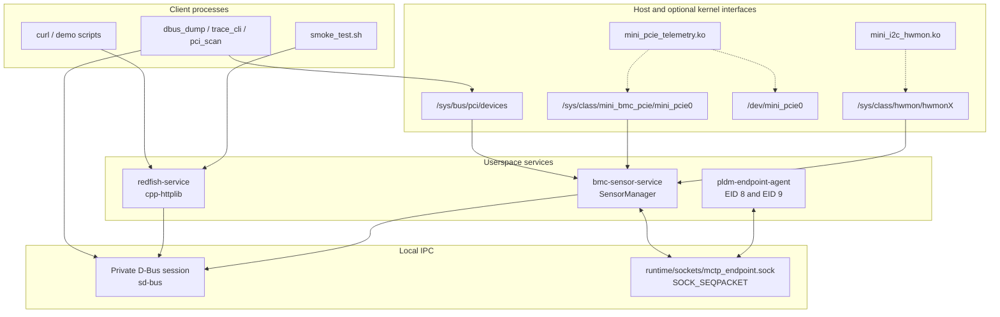
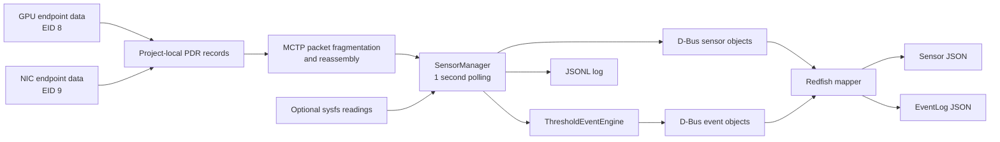
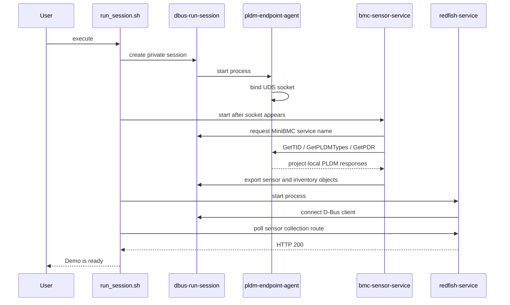
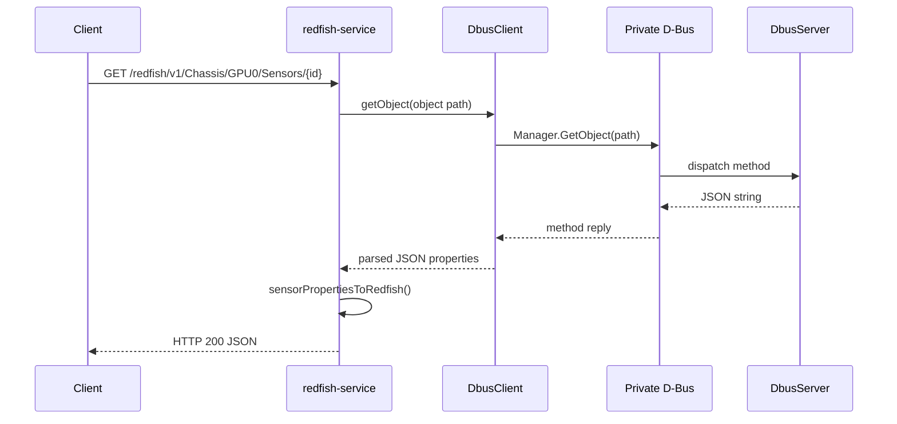
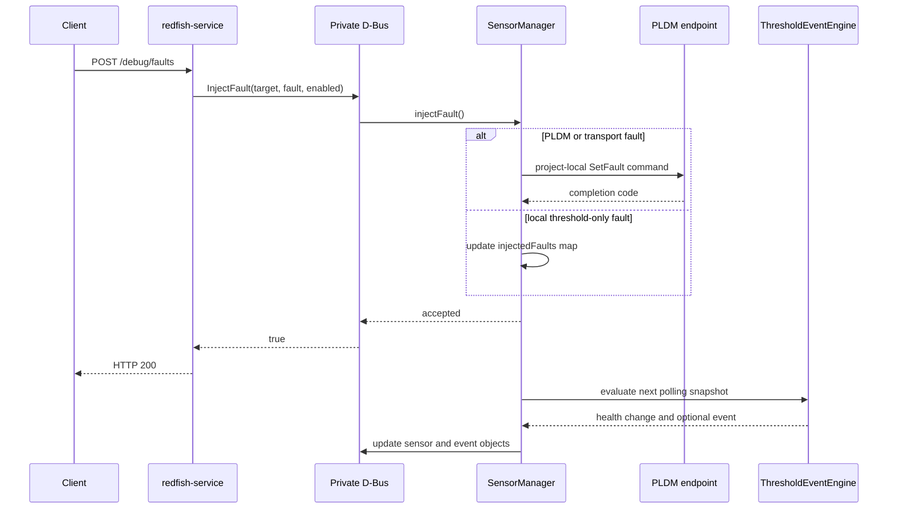
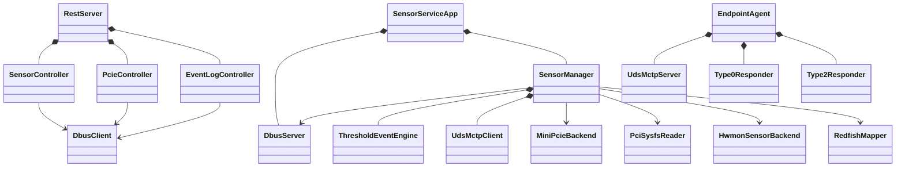
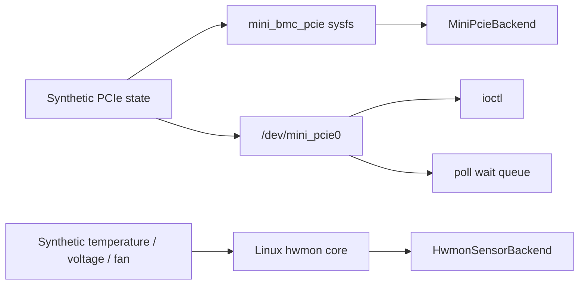

# 架構與流程圖（Architecture and Flow Diagrams）

本文件只描述目前程式碼中可執行的元件與資料路徑。虛線表示選用的 Kernel
Module；未載入 module 時，使用者空間服務仍可透過 PLDM endpoint 與 host PCI
sysfs 執行。

## 系統架構圖（System Architecture Diagram）

對應檔案：

- HTTP 與 routes：`services/redfish-service/`
- D-Bus server/client：`libs/dbus/`
- 感測器聚合：`services/bmc-sensor-service/sensor_manager.cpp`
- UDS transport：`libs/mctp/uds_mctp_transport.cpp`
- PLDM endpoint：`services/pldm-endpoint-agent/`
- sysfs backends：`libs/pcie/`、`libs/hwmon/`
- Kernel providers：`kernel/mini_pcie_telemetry/`、`kernel/mini_i2c_hwmon/`

`redfish-service` 與 `bmc-sensor-service` 只在私有 Session Bus 上互通，沒有
連接 system bus 或現有 OpenBMC service。

## 資料流圖（Data Flow Diagram）

PLDM readings 由 `SensorManager::pollPldm()` 取得；optional sysfs readings 由
`SensorManager::pollKernelTelemetry()` 取得。每次 polling 後，
`publishSensor()` 更新 D-Bus properties。門檻跨越時，
`ThresholdEventEngine` 建立 assertion 或 recovery event，再由
`publishEvent()` 匯出 D-Bus logging object。

## 啟動時序圖（Startup Sequence Diagram）

對應 `scripts/run_session.sh`、`services/*/main.cpp` 與
`SensorManager::discoverPldm()`。腳本只檢查 endpoint socket 與 HTTP sensor
collection 是否 ready，沒有 systemd readiness protocol。

## HTTP 查詢時序圖（Request Sequence Diagram）

這個 route 不直接呼叫 PLDM。HTTP 回應使用最近一次 polling 已發布到 D-Bus
的 snapshot。

## 故障注入時序圖（Fault Injection Sequence Diagram）

`POST /debug/faults` 是測試用途的自訂 route。`out_of_range` 可以直接改變
本地 sensor snapshot；PLDM transport faults 會透過 endpoint 的
`setFault` command 更新模擬行為。

## 模組關係圖（Module Diagram）

這張圖對應 CMake targets `mini_dbus`、`mini_platform`、`mini_protocol`、
`mini_redfish` 與三個 service executable。`RedfishMapper` 名稱代表 JSON
shape mapping，不是獨立程序。

## Kernel telemetry 關係圖

`bmc-sensor-service` 目前只使用 PCIe sysfs 與 hwmon sysfs。Character device、
ioctl 與 poll 由 Kernel Module 提供，但沒有被 service runtime 呼叫；其 ABI
由 header 與單元測試檢查，runtime 行為需在可載入 module 的 Linux 環境驗證。
