# OpenBMC AI Server Management Stack 圖解筆記

這份文件是照目前程式碼畫的，不照外部 OpenBMC 規格硬套。先用圖把路線看懂：程式怎麼啟動、資料怎麼流、事件怎麼變成 Redfish log 和 D-Bus signal。

主要程式碼來源：

- `src/main.cpp`
- `src/app/Application.cpp`
- `src/hardware/*`
- `src/services/*`
- `src/redfish/RedfishApiServer.cpp`
- `src/dbus/DbusBridge.cpp`
- `config/ai_server_profile.json`
- `scripts/*.sh`
- `tests/*.cpp`

## 1. 專案整體目標

這個專案用 `HardwareModel` 模擬一台 AI Server 的 BMC 管理層。外部可以用 HTTP/JSON API 或 D-Bus 讀狀態，也可以用 fault injection API 製造故障，觀察溫控、功耗、事件紀錄會怎麼跟著變。

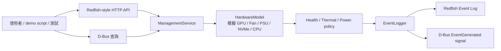
```mermaid
flowchart LR
    User["使用者 / demo script / 測試"] --> HTTP["Redfish-style HTTP API"]
    User --> DBUS["D-Bus 查詢"]
    HTTP --> Mgmt["ManagementService"]
    DBUS --> Mgmt
    Mgmt --> HW["HardwareModel<br/>模擬 GPU / Fan / PSU / NVMe / CPU"]
    HW --> Policy["Health / Thermal / Power policy"]
    Policy --> Events["EventLogger"]
    Events --> HTTPLog["Redfish Event Log"]
    Events --> DBUSSignal["D-Bus EventGenerated signal"]
```

主線可以濃縮成一句：**`HardwareModel` 保存狀態，`ManagementService` 提供入口，`SensorService` 持續推進巡檢流程。**

## 2. 專案目錄圖

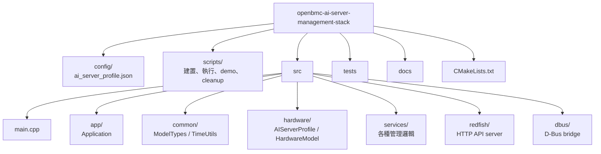
```mermaid
flowchart TB
    Root["openbmc-ai-server-management-stack"]
    Root --> Config["config/<br/>ai_server_profile.json"]
    Root --> Scripts["scripts/<br/>建置、執行、demo、cleanup"]
    Root --> Src["src"]
    Root --> Tests["tests"]
    Root --> Docs["docs"]
    Root --> CMake["CMakeLists.txt"]

    Src --> Main["main.cpp"]
    Src --> App["app/<br/>Application"]
    Src --> Common["common/<br/>ModelTypes / TimeUtils"]
    Src --> Hardware["hardware/<br/>AIServerProfile / HardwareModel"]
    Src --> Services["services/<br/>各種管理邏輯"]
    Src --> Redfish["redfish/<br/>HTTP API server"]
    Src --> Dbus["dbus/<br/>D-Bus bridge"]
```

## 3. 建置與執行順序

`scripts/02_build.sh` 會跑 configure、build、test。`scripts/03_run.sh` 只負責把 build 出來的 `ai-bmc-manager` 跑起來。

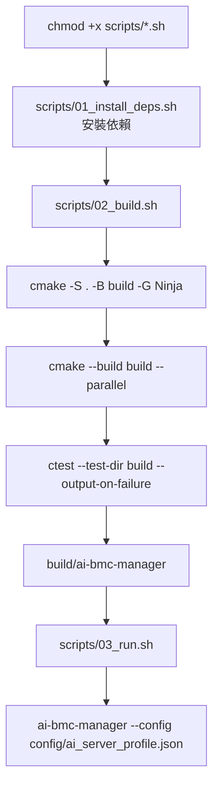
```mermaid
flowchart TD
    A["chmod +x scripts/*.sh"] --> B["scripts/01_install_deps.sh<br/>安裝依賴"]
    B --> C["scripts/02_build.sh"]
    C --> C1["cmake -S . -B build -G Ninja"]
    C1 --> C2["cmake --build build --parallel"]
    C2 --> C3["ctest --test-dir build --output-on-failure"]
    C3 --> D["build/ai-bmc-manager"]
    D --> E["scripts/03_run.sh"]
    E --> F["ai-bmc-manager --config config/ai_server_profile.json"]
```

背景模式的 script 會多管 PID 和 log。

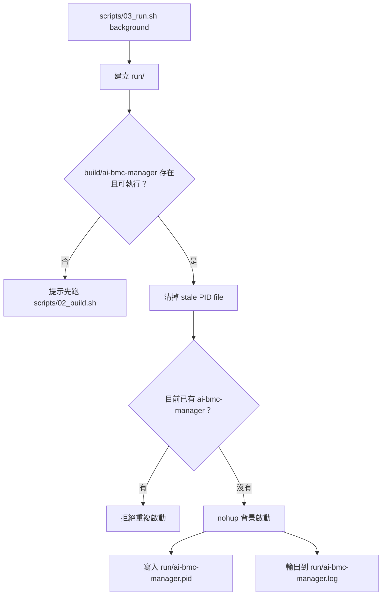
```mermaid
flowchart TD
    A["scripts/03_run.sh background"] --> B["建立 run/"]
    B --> C{"build/ai-bmc-manager 存在且可執行？"}
    C -- "否" --> E["提示先跑 scripts/02_build.sh"]
    C -- "是" --> F["清掉 stale PID file"]
    F --> G{"目前已有 ai-bmc-manager？"}
    G -- "有" --> H["拒絕重複啟動"]
    G -- "沒有" --> I["nohup 背景啟動"]
    I --> J["寫入 run/ai-bmc-manager.pid"]
    I --> K["輸出到 run/ai-bmc-manager.log"]
```

## 4. 預設硬體輪廓

`config/ai_server_profile.json` 目前定義的是一台 8 GPU 的 AI server。

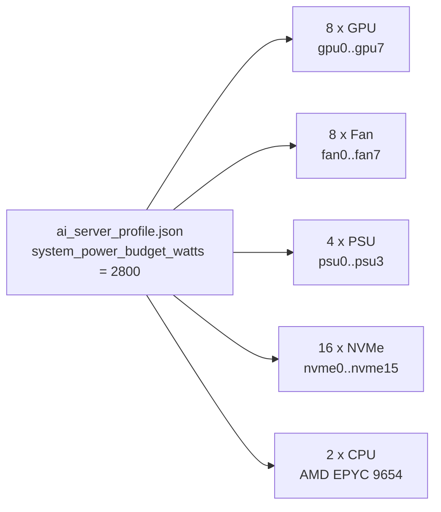
```mermaid
flowchart LR
    Profile["ai_server_profile.json<br/>system_power_budget_watts = 2800"] --> GPU["8 x GPU<br/>gpu0..gpu7"]
    Profile --> FAN["8 x Fan<br/>fan0..fan7"]
    Profile --> PSU["4 x PSU<br/>psu0..psu3"]
    Profile --> NVME["16 x NVMe<br/>nvme0..nvme15"]
    Profile --> CPU["2 x CPU<br/>AMD EPYC 9654"]
```

設定檔載入後會先轉成 `AIServerProfile`，再灌進 `HardwareModel`。

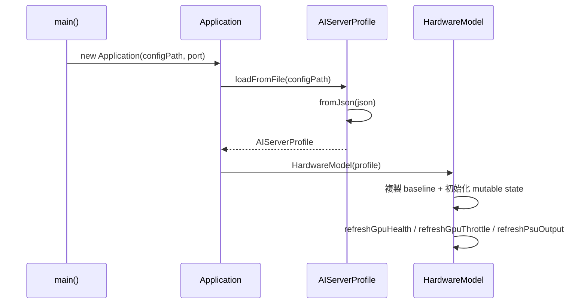
```mermaid
sequenceDiagram
    participant Main as main()
    participant App as Application
    participant Profile as AIServerProfile
    participant HW as HardwareModel

    Main->>App: new Application(configPath, port)
    App->>Profile: loadFromFile(configPath)
    Profile->>Profile: fromJson(json)
    Profile-->>App: AIServerProfile
    App->>HW: HardwareModel(profile)
    HW->>HW: 複製 baseline + 初始化 mutable state
    HW->>HW: refreshGpuHealth / refreshGpuThrottle / refreshPsuOutput
```

## 5. 執行期大架構

這張是最重要的總圖。HTTP 和 D-Bus 不直接碰硬體，也不直接各自實作一套業務邏輯；它們都走 `ManagementService`。

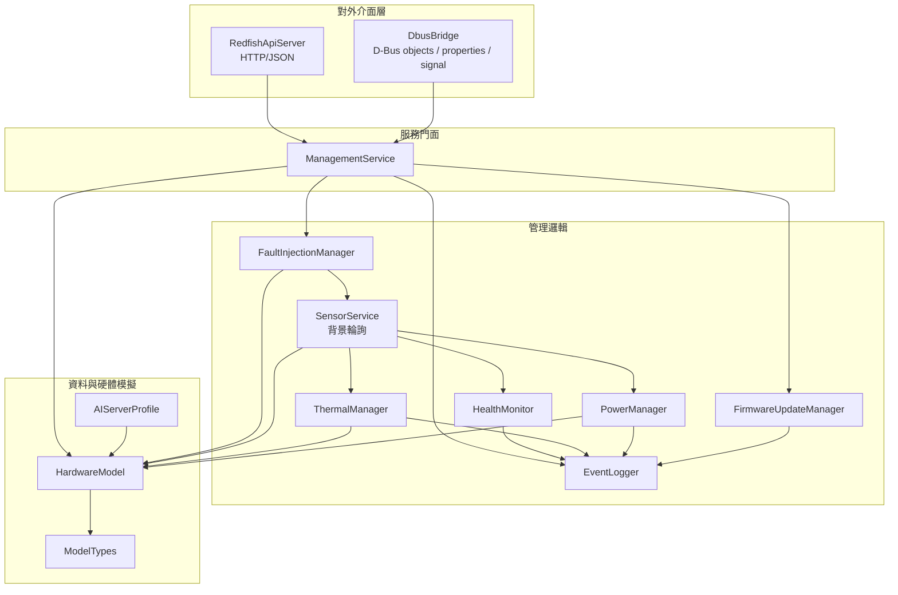
```mermaid
flowchart TB
    subgraph Interface["對外介面層"]
        RF["RedfishApiServer<br/>HTTP/JSON"]
        DB["DbusBridge<br/>D-Bus objects / properties / signal"]
    end

    subgraph Facade["服務門面"]
        MS["ManagementService"]
    end

    subgraph Services["管理邏輯"]
        SS["SensorService<br/>背景輪詢"]
        HM["HealthMonitor"]
        TM["ThermalManager"]
        PM["PowerManager"]
        FI["FaultInjectionManager"]
        FW["FirmwareUpdateManager"]
        EL["EventLogger"]
    end

    subgraph Model["資料與硬體模擬"]
        HW["HardwareModel"]
        MT["ModelTypes"]
        CFG["AIServerProfile"]
    end

    RF --> MS
    DB --> MS
    MS --> HW
    MS --> EL
    MS --> FI
    MS --> FW
    FI --> HW
    FI --> SS
    SS --> HW
    SS --> HM
    SS --> TM
    SS --> PM
    HM --> EL
    TM --> EL
    TM --> HW
    PM --> EL
    PM --> HW
    FW --> EL
    HW --> MT
    CFG --> HW
```

## 6. 物件建立順序

`Application` 建構子把所有東西串起來，這裡也是看依賴關係最快的地方。

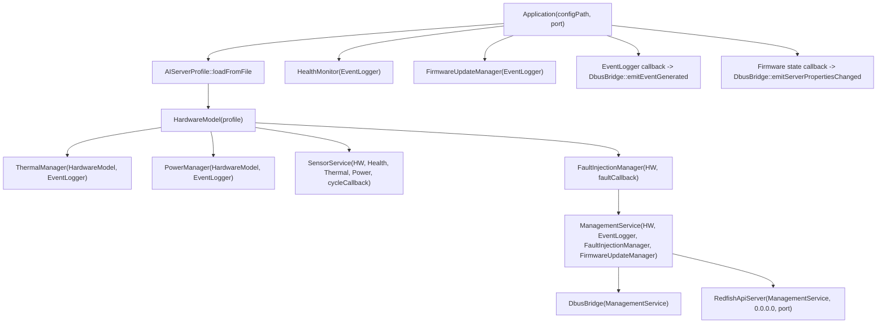
```mermaid
flowchart TD
    A["Application(configPath, port)"] --> P["AIServerProfile::loadFromFile"]
    P --> H["HardwareModel(profile)"]
    H --> T["ThermalManager(HardwareModel, EventLogger)"]
    H --> PM["PowerManager(HardwareModel, EventLogger)"]
    A --> HM["HealthMonitor(EventLogger)"]
    A --> FW["FirmwareUpdateManager(EventLogger)"]
    H --> SS["SensorService(HW, Health, Thermal, Power, cycleCallback)"]
    H --> FI["FaultInjectionManager(HW, faultCallback)"]
    FI --> MS["ManagementService(HW, EventLogger, FaultInjectionManager, FirmwareUpdateManager)"]
    MS --> DB["DbusBridge(ManagementService)"]
    MS --> RF["RedfishApiServer(ManagementService, 0.0.0.0, port)"]
    A --> CB1["EventLogger callback -> DbusBridge::emitEventGenerated"]
    A --> CB2["Firmware state callback -> DbusBridge::emitServerPropertiesChanged"]
```

## 7. `main()` 的生命週期

`main()` 的工作很薄：解析參數、擋住 SIGINT/SIGTERM、啟動 Application、等停止訊號。

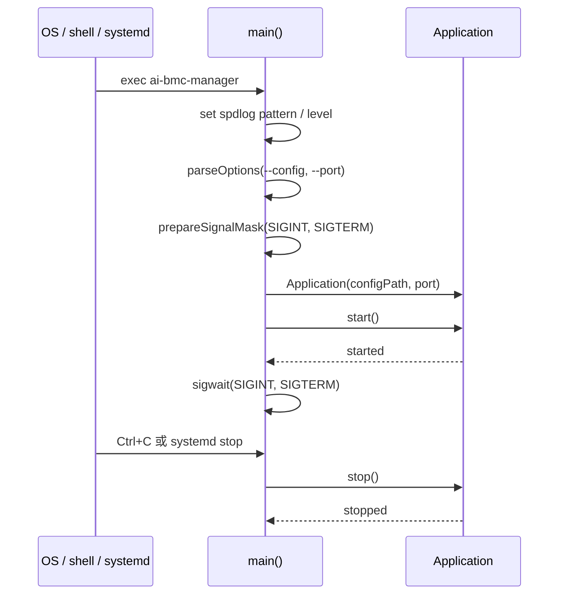
```mermaid
sequenceDiagram
    participant OS as OS / shell / systemd
    participant Main as main()
    participant App as Application

    OS->>Main: exec ai-bmc-manager
    Main->>Main: set spdlog pattern / level
    Main->>Main: parseOptions(--config, --port)
    Main->>Main: prepareSignalMask(SIGINT, SIGTERM)
    Main->>App: Application(configPath, port)
    Main->>App: start()
    App-->>Main: started
    Main->>Main: sigwait(SIGINT, SIGTERM)
    OS->>Main: Ctrl+C 或 systemd stop
    Main->>App: stop()
    App-->>Main: stopped
```

參數處理也很單純。

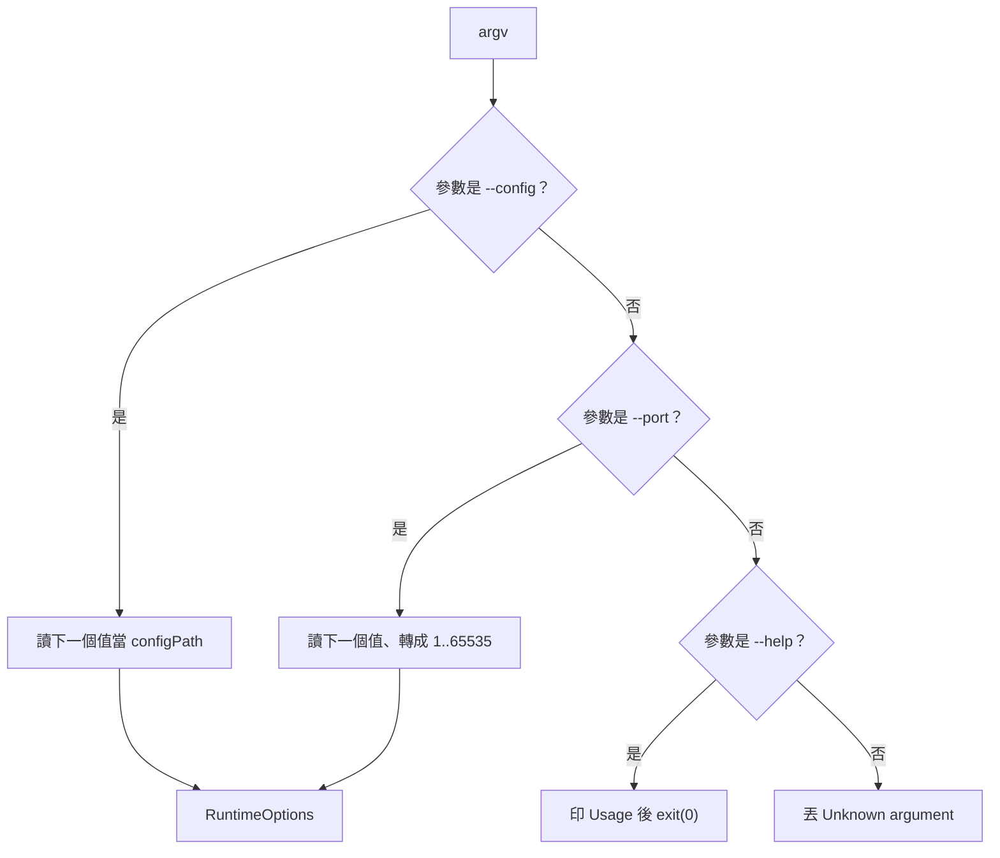
```mermaid
flowchart TD
    A["argv"] --> B{"參數是 --config？"}
    B -- "是" --> C["讀下一個值當 configPath"]
    B -- "否" --> D{"參數是 --port？"}
    D -- "是" --> E["讀下一個值、轉成 1..65535"]
    D -- "否" --> F{"參數是 --help？"}
    F -- "是" --> G["印 Usage 後 exit(0)"]
    F -- "否" --> H["丟 Unknown argument"]
    C --> I["RuntimeOptions"]
    E --> I
```

## 8. `Application::start()` 啟動順序

啟動順序是固定的：D-Bus 先起，感測輪詢再起，HTTP 最後起，接著要求一次立即輪詢。

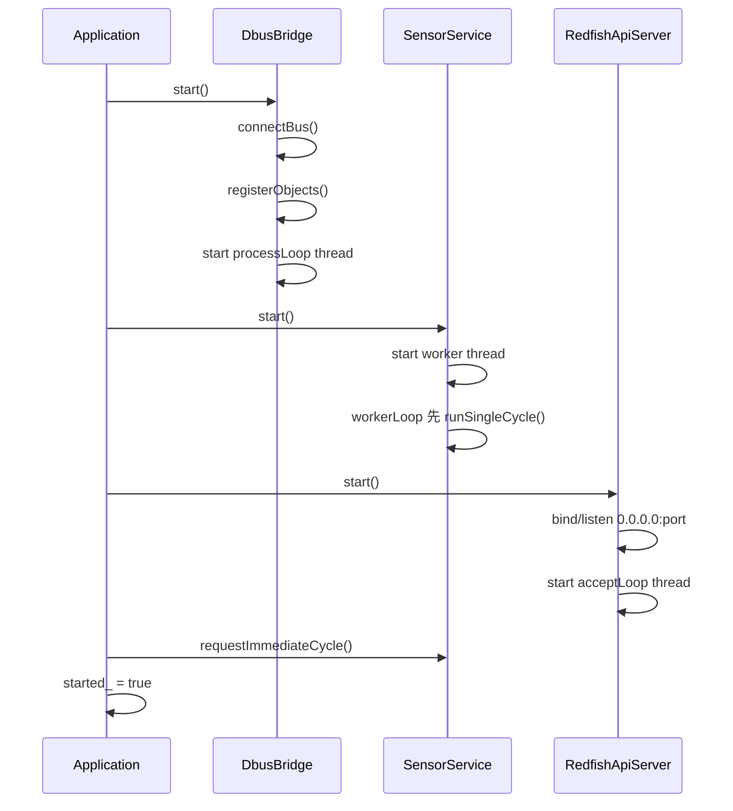
```mermaid
sequenceDiagram
    participant App as Application
    participant DB as DbusBridge
    participant SS as SensorService
    participant RF as RedfishApiServer

    App->>DB: start()
    DB->>DB: connectBus()
    DB->>DB: registerObjects()
    DB->>DB: start processLoop thread
    App->>SS: start()
    SS->>SS: start worker thread
    SS->>SS: workerLoop 先 runSingleCycle()
    App->>RF: start()
    RF->>RF: bind/listen 0.0.0.0:port
    RF->>RF: start acceptLoop thread
    App->>SS: requestImmediateCycle()
    App->>App: started_ = true
```

如果啟動中途失敗，會反向清掉已經起來的元件。

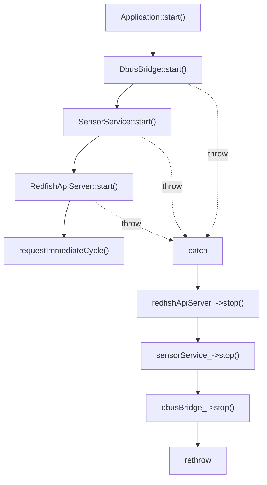
```mermaid
flowchart TD
    A["Application::start()"] --> B["DbusBridge::start()"]
    B --> C["SensorService::start()"]
    C --> D["RedfishApiServer::start()"]
    D --> E["requestImmediateCycle()"]
    B -. "throw" .-> X["catch"]
    C -. "throw" .-> X
    D -. "throw" .-> X
    X --> Y["redfishApiServer_->stop()"]
    Y --> Z["sensorService_->stop()"]
    Z --> W["dbusBridge_->stop()"]
    W --> R["rethrow"]
```

## 9. `Application::stop()` 停止順序

停止時先關外部 HTTP，再停背景感測，最後停 D-Bus。

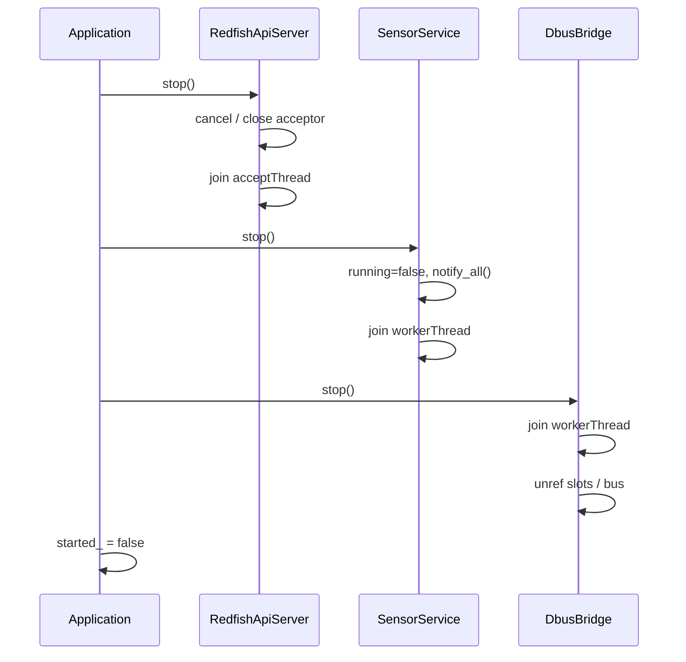
```mermaid
sequenceDiagram
    participant App as Application
    participant RF as RedfishApiServer
    participant SS as SensorService
    participant DB as DbusBridge

    App->>RF: stop()
    RF->>RF: cancel / close acceptor
    RF->>RF: join acceptThread
    App->>SS: stop()
    SS->>SS: running=false, notify_all()
    SS->>SS: join workerThread
    App->>DB: stop()
    DB->>DB: join workerThread
    DB->>DB: unref slots / bus
    App->>App: started_ = false
```

## 10. 執行緒模型

執行時至少包含 main、sensor worker、D-Bus worker、HTTP accept worker；每個 HTTP session 又是 detached thread。韌體更新開始後也會有一條 worker。

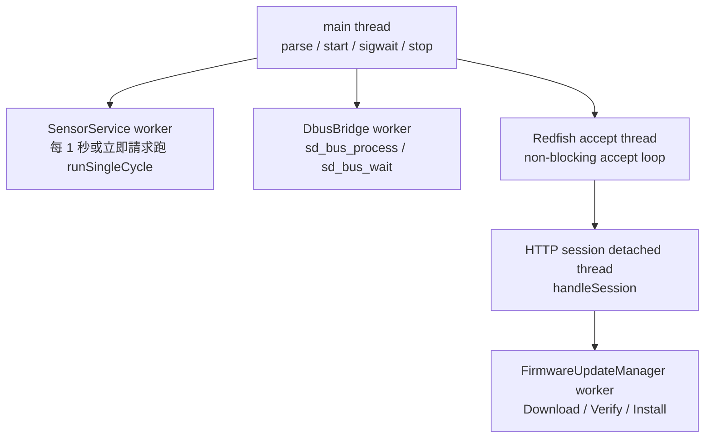
```mermaid
flowchart TB
    Main["main thread<br/>parse / start / sigwait / stop"]
    Sensor["SensorService worker<br/>每 1 秒或立即請求跑 runSingleCycle"]
    Dbus["DbusBridge worker<br/>sd_bus_process / sd_bus_wait"]
    HttpAccept["Redfish accept thread<br/>non-blocking accept loop"]
    HttpSession["HTTP session detached thread<br/>handleSession"]
    Fw["FirmwareUpdateManager worker<br/>Download / Verify / Install"]

    Main --> Sensor
    Main --> Dbus
    Main --> HttpAccept
    HttpAccept --> HttpSession
    HttpSession --> Fw
```

共享資料靠幾個 mutex 保護。

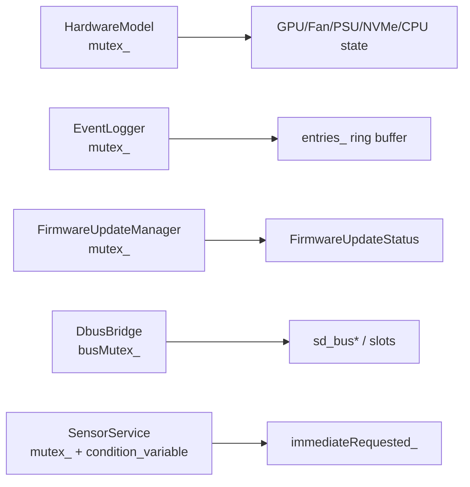
```mermaid
flowchart LR
    HM["HardwareModel<br/>mutex_"] --> S1["GPU/Fan/PSU/NVMe/CPU state"]
    EL["EventLogger<br/>mutex_"] --> S2["entries_ ring buffer"]
    FW["FirmwareUpdateManager<br/>mutex_"] --> S3["FirmwareUpdateStatus"]
    DB["DbusBridge<br/>busMutex_"] --> S4["sd_bus* / slots"]
    SS["SensorService<br/>mutex_ + condition_variable"] --> S5["immediateRequested_"]
```

## 11. Snapshot 資料結構

HTTP 和 D-Bus 都是讀 snapshot，不會直接拿內部 vector 參考。這讓外部介面讀到的是某個時間點的快照。

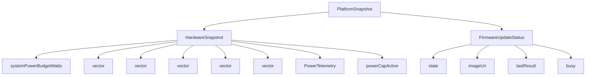
```mermaid
flowchart TB
    Platform["PlatformSnapshot"] --> Hardware["HardwareSnapshot"]
    Platform --> Firmware["FirmwareUpdateStatus"]

    Hardware --> Budget["systemPowerBudgetWatts"]
    Hardware --> GpuVec["vector<GpuDevice>"]
    Hardware --> FanVec["vector<FanDevice>"]
    Hardware --> PsuVec["vector<PsuDevice>"]
    Hardware --> NvmeVec["vector<NvmeDevice>"]
    Hardware --> CpuVec["vector<CpuDevice>"]
    Hardware --> PowerTelemetry["PowerTelemetry"]
    Hardware --> PowerCap["powerCapActive"]

    Firmware --> State["state"]
    Firmware --> Image["imageUri"]
    Firmware --> Result["lastResult"]
    Firmware --> Busy["busy"]
```

各 device 最常被 API 讀到的欄位：

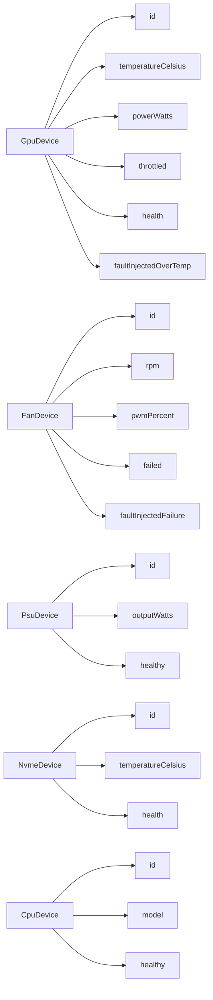
```mermaid
flowchart LR
    GPU["GpuDevice"] --> GPU1["id"]
    GPU --> GPU2["temperatureCelsius"]
    GPU --> GPU3["powerWatts"]
    GPU --> GPU4["throttled"]
    GPU --> GPU5["health"]
    GPU --> GPU6["faultInjectedOverTemp"]

    FAN["FanDevice"] --> FAN1["id"]
    FAN --> FAN2["rpm"]
    FAN --> FAN3["pwmPercent"]
    FAN --> FAN4["failed"]
    FAN --> FAN5["faultInjectedFailure"]

    PSU["PsuDevice"] --> PSU1["id"]
    PSU --> PSU2["outputWatts"]
    PSU --> PSU3["healthy"]

    NVME["NvmeDevice"] --> NV1["id"]
    NVME --> NV2["temperatureCelsius"]
    NVME --> NV3["health"]

    CPU["CpuDevice"] --> CPU1["id"]
    CPU --> CPU2["model"]
    CPU --> CPU3["healthy"]
```

## 12. 核心輪詢週期

`SensorService::runSingleCycle()` 是這個專案的心跳。

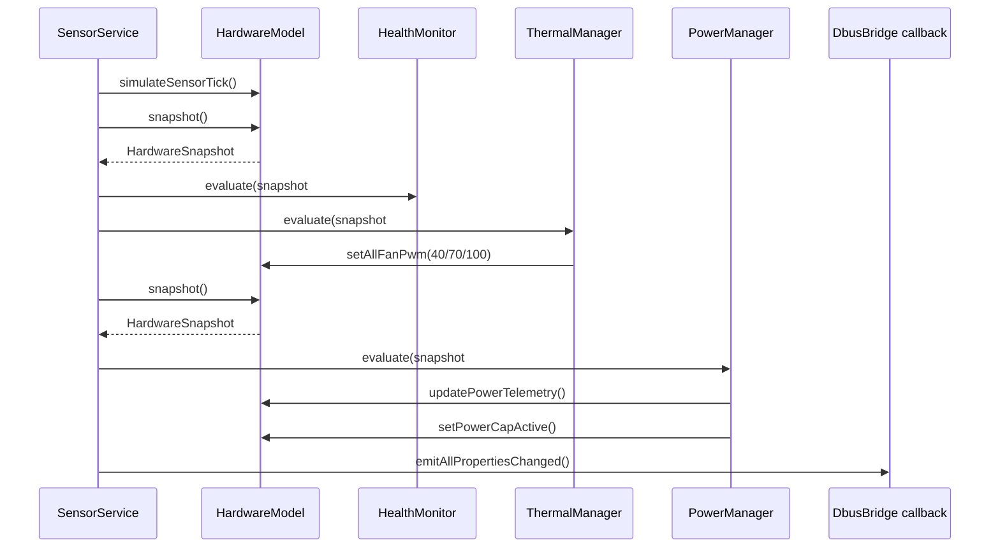
```mermaid
sequenceDiagram
    participant SS as SensorService
    participant HW as HardwareModel
    participant HM as HealthMonitor
    participant TM as ThermalManager
    participant PM as PowerManager
    participant DB as DbusBridge callback

    SS->>HW: simulateSensorTick()
    SS->>HW: snapshot()
    HW-->>SS: HardwareSnapshot #1
    SS->>HM: evaluate(snapshot #1)
    SS->>TM: evaluate(snapshot #1)
    TM->>HW: setAllFanPwm(40/70/100)
    SS->>HW: snapshot()
    HW-->>SS: HardwareSnapshot #2
    SS->>PM: evaluate(snapshot #2)
    PM->>HW: updatePowerTelemetry()
    PM->>HW: setPowerCapActive()
    SS->>DB: emitAllPropertiesChanged()
```

同一件事用資料流來看：

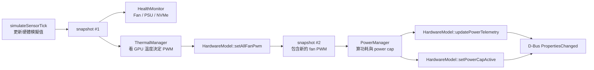
```mermaid
flowchart LR
    Tick["simulateSensorTick<br/>更新硬體模擬值"] --> Snap1["snapshot #1"]
    Snap1 --> Health["HealthMonitor<br/>Fan / PSU / NVMe"]
    Snap1 --> Thermal["ThermalManager<br/>看 GPU 溫度決定 PWM"]
    Thermal --> PWM["HardwareModel::setAllFanPwm"]
    PWM --> Snap2["snapshot #2<br/>包含新的 fan PWM"]
    Snap2 --> Power["PowerManager<br/>算功耗與 power cap"]
    Power --> Telemetry["HardwareModel::updatePowerTelemetry"]
    Power --> Cap["HardwareModel::setPowerCapActive"]
    Telemetry --> Changed["D-Bus PropertiesChanged"]
    Cap --> Changed
```

## 13. `HardwareModel::simulateSensorTick()` 內部

這裡會加隨機 noise，所以 demo 每秒數字會動。

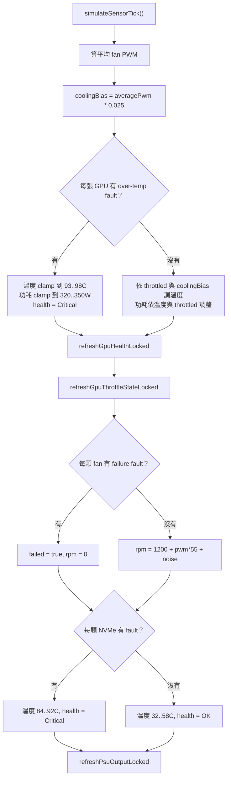
```mermaid
flowchart TD
    A["simulateSensorTick()"] --> B["算平均 fan PWM"]
    B --> C["coolingBias = averagePwm * 0.025"]
    C --> D{"每張 GPU 有 over-temp fault？"}
    D -- "有" --> E["溫度 clamp 到 93..98C<br/>功耗 clamp 到 320..350W<br/>health = Critical"]
    D -- "沒有" --> F["依 throttled 與 coolingBias 調溫度<br/>功耗依溫度與 throttled 調整"]
    E --> G["refreshGpuHealthLocked"]
    F --> G
    G --> H["refreshGpuThrottleStateLocked"]
    H --> I{"每顆 fan 有 failure fault？"}
    I -- "有" --> J["failed = true, rpm = 0"]
    I -- "沒有" --> K["rpm = 1200 + pwm*55 + noise"]
    J --> L{"每顆 NVMe 有 fault？"}
    K --> L
    L -- "有" --> M["溫度 84..92C, health = Critical"]
    L -- "沒有" --> N["溫度 32..58C, health = OK"]
    M --> O["refreshPsuOutputLocked"]
    N --> O
```

GPU throttling 的判斷很直接。

```mermaid
flowchart LR
    A["refreshGpuThrottleStateLocked()"] --> B{"powerCapActive_ == true？"}
    B -- "是" --> T["gpu.throttled = true"]
    B -- "否" --> C{"gpu.temperatureCelsius > 90C？"}
    C -- "是" --> T
    C -- "否" --> F["gpu.throttled = false"]
```

## 14. 溫控策略圖

`ThermalManager` 看的是所有 GPU 的最高溫。

```mermaid
flowchart TD
    A["ThermalManager::evaluate(snapshot)"] --> B["找 maxGpuTemperature"]
    B --> C{"max < 70C？"}
    C -- "是" --> P40["fan PWM = 40%"]
    C -- "否" --> D{"70C <= max <= 85C？"}
    D -- "是" --> P70["fan PWM = 70%"]
    D -- "否" --> P100["fan PWM = 100%"]
    P40 --> SET["HardwareModel::setAllFanPwm"]
    P70 --> SET
    P100 --> SET
    SET --> E{"逐張 GPU 檢查溫度 > 85C？"}
    E -- "是，且尚未 latch" --> LOG["EventLogger::logEvent(GPU_OVER_TEMP)"]
    E -- "否" --> CLEAR["清掉該 GPU 的 overTemp latch"]
```

溫度事件的嚴重度：

```mermaid
flowchart LR
    A["GPU temperature"] --> B{" > 90C？"}
    B -- "是" --> C["Critical<br/>message 會提 thermal throttling active"]
    B -- "否，但 > 85C" --> D["Warning"]
    B -- "<= 85C" --> E["不新增事件，解除 latch"]
```

## 15. 健康檢查策略圖

`HealthMonitor` 只負責 Fan、PSU、NVMe 的故障事件。

```mermaid
flowchart TD
    A["HealthMonitor::evaluate(snapshot)"] --> F{"fan.failed？"}
    F -- "是，第一次看到" --> FE["FAN_FAILURE / Critical"]
    F -- "否" --> FL["解除 fan latch"]

    A --> P{"psu.healthy == false？"}
    P -- "是，第一次看到" --> PE["PSU_FAILURE / Critical"]
    P -- "否" --> PL["解除 psu latch"]

    A --> N{"nvme.health != OK？"}
    N -- "是，第一次看到" --> NE["NVME_FAULT / Warning"]
    N -- "否" --> NL["解除 nvme latch"]
```

這裡的 latch 是避免同一顆風扇每秒洗一筆一樣的事件。

```mermaid
stateDiagram-v2
    [*] --> Normal
    Normal --> FaultLatched: 第一次偵測到故障 / log event
    FaultLatched --> FaultLatched: 故障仍存在 / 不重複 log
    FaultLatched --> Normal: 狀態恢復 / 清 latch
```

## 16. 功耗策略圖

`PowerManager` 算的是 GPU + Fan + NVMe 的總功耗，拿去比 `system_power_budget_watts`。注意：`HardwareModel::refreshPsuOutputLocked()` 會把 CPU 90W * CPU 數量算進 PSU output，但 `PowerManager::totalSystemPowerWatts` 沒把 CPU 加進去。

```mermaid
flowchart TD
    A["PowerManager::evaluate(snapshot)"] --> G["totalGpuPower = sum(gpu.powerWatts)"]
    A --> F["totalFanPower = sum(2 + pwm*0.12)，failed fan 算 0"]
    A --> P["totalPsuPower = sum(psu.outputWatts)"]
    A --> N["totalNvmePower = Critical?16W:12W"]
    G --> S["totalSystemPower = GPU + Fan + NVMe"]
    F --> S
    N --> S
    S --> B{"totalSystemPower > systemPowerBudgetWatts？"}
    B -- "是" --> C["budgetExceeded = true"]
    B -- "否" --> D["budgetExceeded = false"]
    C --> U["HardwareModel::updatePowerTelemetry"]
    D --> U
    U --> CAP["HardwareModel::setPowerCapActive(budgetExceeded)"]
    C --> L{"之前沒有 exceed latch？"}
    L -- "是" --> E["EventLogger::logEvent(POWER_CAP_TRIGGERED)"]
```

power cap 啟動後，所有 GPU 都會被標成 throttled。

```mermaid
flowchart LR
    Exceed["budgetExceeded = true"] --> Set["setPowerCapActive(true)"]
    Set --> Refresh["refreshGpuThrottleStateLocked()"]
    Refresh --> G0["gpu0.throttled = true"]
    Refresh --> G1["gpu1.throttled = true"]
    Refresh --> G2["..."]
    Refresh --> G7["gpu7.throttled = true"]
```

## 17. EventLogger 圖

所有 manager 都把事件交給 `EventLogger`。`EventLogger` 存 512 筆，滿了會丟掉最舊那筆。

```mermaid
flowchart TD
    Source["Thermal / Power / Health / Firmware"] --> Log["EventLogger::logEvent"]
    Log --> Timestamp["makeUtcTimestamp()"]
    Timestamp --> Lock["lock mutex_"]
    Lock --> Full{"entries_.size() >= 512？"}
    Full -- "是" --> Erase["erase(entries_.begin())"]
    Full -- "否" --> Push["push_back(record)"]
    Erase --> Push
    Push --> CopyCb["複製 callback"]
    CopyCb --> Unlock["unlock mutex_"]
    Unlock --> Callback{"callback 存在？"}
    Callback -- "是" --> Emit["DbusBridge::emitEventGenerated(record)"]
    Callback -- "否" --> Done["結束"]
```

事件來源對照：

```mermaid
flowchart LR
    Thermal["ThermalManager"] --> GPUOver["GPU_OVER_TEMP"]
    Power["PowerManager"] --> PowerCap["POWER_CAP_TRIGGERED"]
    Health["HealthMonitor"] --> FanFail["FAN_FAILURE"]
    Health --> PsuFail["PSU_FAILURE"]
    Health --> NvmeFault["NVME_FAULT"]
    Firmware["FirmwareUpdateManager"] --> FwEvents["FW_UPDATE_STARTED<br/>FW_VERIFY_STARTED<br/>FW_INSTALL_STARTED<br/>FW_UPDATE_COMPLETED<br/>FW_VERIFY_FAILED<br/>FW_UPDATE_FAILED<br/>FW_ROLLBACK_TRIGGERED"]
```

## 18. HTTP API 路由總圖

`RedfishApiServer::handleSession()` 是一個很直的 if/else route table。

```mermaid
flowchart TB
    HTTP["HTTP request"] --> H["RedfishApiServer::handleSession"]
    H --> Root["GET /redfish/v1"]
    H --> Sys["GET /redfish/v1/Systems/system"]
    H --> Chassis["GET /redfish/v1/Chassis/chassis"]
    H --> Thermal["GET /redfish/v1/Chassis/chassis/Thermal"]
    H --> Power["GET /redfish/v1/Chassis/chassis/Power"]
    H --> Manager["GET /redfish/v1/Managers/bmc"]
    H --> Logs["GET /redfish/v1/Managers/bmc/LogServices/EventLog/Entries"]
    H --> Update["GET /redfish/v1/UpdateService"]
    H --> SimpleUpdate["POST /redfish/v1/UpdateService/Actions/UpdateService.SimpleUpdate"]
    H --> GpuFault["POST /api/fault/gpu-overtemp/{id}"]
    H --> FanFault["POST /api/fault/fan-failure/{id}"]
    H --> PsuFault["POST /api/fault/psu-failure/{id}"]
    H --> NvmeFault["POST /api/fault/nvme-fault/{id}"]
    H --> Clear["POST /api/fault/clear"]
    H --> NotFound["其他路由 -> 404 JSON error"]
```

HTTP session 進來後，會先抓一次平台 snapshot，再依路由組 JSON。

```mermaid
sequenceDiagram
    participant Client as HTTP client
    participant RF as RedfishApiServer
    participant MS as ManagementService
    participant HW as HardwareModel
    participant FW as FirmwareUpdateManager

    Client->>RF: GET /redfish/v1/Chassis/chassis/Power
    RF->>MS: getPlatformSnapshot()
    MS->>HW: snapshot()
    HW-->>MS: HardwareSnapshot
    MS->>FW: status()
    FW-->>MS: FirmwareUpdateStatus
    MS-->>RF: PlatformSnapshot
    RF->>RF: 組 Power JSON
    RF-->>Client: 200 application/json
```

## 19. Redfish-style API 導覽

這套 API 採 Redfish-inspired 結構，完整 Redfish compliance 不在目前範圍內。

```mermaid
flowchart TD
    Root["/redfish/v1<br/>Service Root"] --> Systems["/redfish/v1/Systems/system"]
    Root --> Chassis["/redfish/v1/Chassis/chassis"]
    Root --> Managers["/redfish/v1/Managers/bmc"]
    Root --> Update["/redfish/v1/UpdateService"]
    Chassis --> Thermal["/redfish/v1/Chassis/chassis/Thermal"]
    Chassis --> Power["/redfish/v1/Chassis/chassis/Power"]
    Managers --> Entries["/redfish/v1/Managers/bmc/LogServices/EventLog/Entries"]
    Update --> Simple["/redfish/v1/UpdateService/Actions/UpdateService.SimpleUpdate"]
```

Thermal API 的資料來源：

```mermaid
flowchart LR
    HW["HardwareSnapshot"] --> Gpu["gpus[]"]
    HW --> Fan["fans[]"]
    Gpu --> TempJson["Temperatures[]<br/>ReadingCelsius / Health / PowerWatts / Throttled"]
    Fan --> FanJson["Fans[]<br/>ReadingRPM / PwmPercent / Health"]
    TempJson --> Response["GET /Chassis/chassis/Thermal"]
    FanJson --> Response
```

Power API 的資料來源：

```mermaid
flowchart LR
    HW["HardwareSnapshot"] --> Telemetry["powerTelemetry"]
    HW --> Budget["systemPowerBudgetWatts"]
    HW --> Psus["psus[]"]
    Telemetry --> PowerControl["PowerControl[0]<br/>PowerConsumedWatts / BudgetExceeded"]
    Budget --> PowerLimit["PowerLimit.LimitInWatts"]
    Psus --> PowerSupplies["PowerSupplies[]<br/>PowerOutputWatts / Health"]
    PowerControl --> Response["GET /Chassis/chassis/Power"]
    PowerLimit --> Response
    PowerSupplies --> Response
```

## 20. HTTP 錯誤路徑

```mermaid
flowchart TD
    Req["HTTP request"] --> Route{"找到 route？"}
    Route -- "否" --> NotFound["404<br/>{ error: Route not found }"]
    Route -- "是，SimpleUpdate" --> Parse{"JSON parse 成功？"}
    Parse -- "否" --> Bad["400<br/>{ error: Invalid JSON body }"]
    Parse -- "是" --> Image{"image_uri 可接受？"}
    Image -- "空字串" --> Conflict1["409<br/>image_uri must not be empty"]
    Image -- "忙碌中" --> Conflict2["409<br/>Firmware update already in progress"]
    Image -- "可接受" --> Accepted["202<br/>Firmware update workflow started"]
```

fault injection id 會先 normalize。例如 `/api/fault/fan-failure/0` 會被轉成 `fan0`。

```mermaid
flowchart LR
    Raw["rawTarget = 0"] --> Check{"全是數字？"}
    Check -- "是" --> Prefix["prefix + rawTarget"]
    Prefix --> Fan["fan0"]
    Raw2["rawTarget = fan0"] --> Check2{"全是數字？"}
    Check2 -- "否" --> Keep["保留 fan0"]
```

## 21. 故障注入總流程

fault injection API 不直接寫事件。它只改 `HardwareModel`，然後要求 `SensorService` 立刻跑一輪，事件由 Health/Thermal/Power policy 自己產生。

```mermaid
sequenceDiagram
    participant Client as HTTP client
    participant RF as RedfishApiServer
    participant MS as ManagementService
    participant FI as FaultInjectionManager
    participant HW as HardwareModel
    participant SS as SensorService
    participant Policy as Health/Thermal/Power
    participant EL as EventLogger
    participant DB as DbusBridge

    Client->>RF: POST /api/fault/fan-failure/fan0
    RF->>MS: injectFanFailure("fan0")
    MS->>FI: injectFanFailure("fan0")
    FI->>HW: injectFanFailure("fan0")
    HW-->>FI: changed = true
    FI->>SS: requestImmediateCycle()
    RF-->>Client: 202 Accepted
    SS->>Policy: runSingleCycle()
    Policy->>EL: logEvent(FAN_FAILURE)
    EL->>DB: emitEventGenerated(record)
    SS->>DB: emitAllPropertiesChanged()
```

## 22. Fan failure 行為圖

```mermaid
flowchart TD
    A["POST /api/fault/fan-failure/fan0"] --> B["HardwareModel::injectFanFailure"]
    B --> C["fan0.faultInjectedFailure = true"]
    C --> D["fan0.failed = true"]
    D --> E["fan0.rpm = 0"]
    E --> F["requestImmediateCycle"]
    F --> G["HealthMonitor 看到 fan.failed"]
    G --> H["EventLogger FAN_FAILURE / Critical"]
    H --> I["D-Bus EventGenerated"]
    G --> J["Thermal API 顯示 fan0 ReadingRPM = 0"]
```

## 23. GPU over-temp 行為圖

```mermaid
flowchart TD
    A["POST /api/fault/gpu-overtemp/gpu0"] --> B["HardwareModel::injectGpuOverTemp"]
    B --> C["gpu0.faultInjectedOverTemp = true"]
    C --> D["gpu0.temperatureCelsius = 95C"]
    D --> E["gpu0.powerWatts = 340W"]
    E --> F["gpu0.health = Critical"]
    F --> G["refreshGpuThrottleStateLocked"]
    G --> H["gpu0.throttled = true"]
    H --> I["requestImmediateCycle"]
    I --> J["ThermalManager fan PWM = 100%"]
    J --> K["EventLogger GPU_OVER_TEMP"]
```

如果 demo 把 8 張 GPU 都推到過熱，功耗路徑也會被推起來。

```mermaid
flowchart LR
    G0["gpu0..gpu7<br/>over-temp fault"] --> Power["GPU power 接近 320..350W/張"]
    Power --> Sum["totalGpuPower 上升"]
    Sum --> Budget{"totalSystemPower > 2800W？"}
    Budget -- "是" --> Cap["POWER_CAP_TRIGGERED<br/>powerCapActive = true"]
    Cap --> Throttle["所有 GPU throttled"]
```

## 24. PSU failure 行為圖

```mermaid
flowchart TD
    A["POST /api/fault/psu-failure/psu0"] --> B["HardwareModel::injectPsuFailure"]
    B --> C["psu0.faultInjectedFailure = true"]
    C --> D["psu0.healthy = false"]
    D --> E["psu0.outputWatts = 0"]
    E --> F["refreshPsuOutputLocked"]
    F --> G["其他 healthy PSU 分攤負載"]
    G --> H["requestImmediateCycle"]
    H --> I["HealthMonitor -> PSU_FAILURE / Critical"]
```

## 25. NVMe fault 行為圖

```mermaid
flowchart TD
    A["POST /api/fault/nvme-fault/nvme0"] --> B["HardwareModel::injectNvmeFault"]
    B --> C["nvme0.faultInjectedFailure = true"]
    C --> D["nvme0.temperatureCelsius = 88C"]
    D --> E["nvme0.health = Critical"]
    E --> F["requestImmediateCycle"]
    F --> G["HealthMonitor 看到 health != OK"]
    G --> H["EventLogger NVME_FAULT / Warning"]
```

## 26. 清除故障

`POST /api/fault/clear` 會把 GPU / Fan / PSU / NVMe 回復成設定檔 baseline，接著要求一次立即輪詢，讓 policy 重新算。

```mermaid
sequenceDiagram
    participant Client as HTTP client
    participant RF as RedfishApiServer
    participant MS as ManagementService
    participant FI as FaultInjectionManager
    participant HW as HardwareModel
    participant SS as SensorService

    Client->>RF: POST /api/fault/clear
    RF->>MS: clearFaults()
    MS->>FI: clearAllFaults()
    FI->>HW: clearFaults()
    HW->>HW: gpus/fans/psus/nvmes = baselineProfile
    HW->>HW: refresh health / throttle / psu output
    FI->>SS: requestImmediateCycle()
    RF-->>Client: 202 Accepted
```

## 27. 韌體更新狀態機

韌體更新是 demo workflow，用 `image_uri` 字串決定成功或故障分支。

```mermaid
stateDiagram-v2
    [*] --> Idle
    Idle --> Downloading: startUpdate(image_uri)
    Downloading --> Verifying: 500ms
    Verifying --> Rollback: image_uri 含 bad / verify-fail / corrupt
    Verifying --> Installing: 驗證通過
    Installing --> Rollback: image_uri 含 install-fail / fail-install
    Installing --> RebootPending: 安裝完成
    RebootPending --> Completed: 500ms
    Rollback --> [*]
    Completed --> [*]
```

成功路徑：

```mermaid
sequenceDiagram
    participant Client as HTTP client
    participant RF as RedfishApiServer
    participant MS as ManagementService
    participant FW as FirmwareUpdateManager
    participant EL as EventLogger
    participant DB as DbusBridge

    Client->>RF: POST SimpleUpdate { image_uri }
    RF->>MS: startFirmwareUpdate(imageUri, message)
    MS->>FW: startUpdate(imageUri, message)
    FW-->>RF: true, workflow started
    RF-->>Client: 202 Accepted
    FW->>EL: FW_UPDATE_STARTED
    FW->>DB: FirmwareState = Downloading
    FW->>EL: FW_VERIFY_STARTED
    FW->>DB: FirmwareState = Verifying
    FW->>EL: FW_INSTALL_STARTED
    FW->>DB: FirmwareState = Installing
    FW->>DB: FirmwareState = RebootPending
    FW->>DB: FirmwareState = Completed
    FW->>EL: FW_UPDATE_COMPLETED
```

失敗路徑：

```mermaid
flowchart TD
    A["startUpdate(image_uri)"] --> B{"image_uri 空？"}
    B -- "是" --> R1["拒絕：image_uri must not be empty"]
    B -- "否" --> C{"目前 busy？"}
    C -- "是" --> R2["拒絕：already in progress"]
    C -- "否" --> D["下載"]
    D --> E["驗證"]
    E --> F{"URI 含 bad / verify-fail / corrupt？"}
    F -- "是" --> VFail["FW_VERIFY_FAILED + FW_ROLLBACK_TRIGGERED<br/>state = Rollback"]
    F -- "否" --> G["安裝"]
    G --> H{"URI 含 install-fail / fail-install？"}
    H -- "是" --> IFail["FW_UPDATE_FAILED + FW_ROLLBACK_TRIGGERED<br/>state = Rollback"]
    H -- "否" --> OK["RebootPending -> Completed"]
```

## 28. D-Bus 連線策略

啟動時先試 system bus，拿不到 service name 就 fallback 到 user bus。

```mermaid
flowchart TD
    A["DbusBridge::connectBus()"] --> B["sd_bus_open_system"]
    B --> C{"連上 system bus？"}
    C -- "否" --> U["sd_bus_open_user"]
    C -- "是" --> D["sd_bus_request_name(system)"]
    D --> E{"拿到 xyz.openbmc_project.AIServer？"}
    E -- "是" --> S["busMode_ = system"]
    E -- "否" --> W["log warning, unref system bus"]
    W --> U
    U --> V{"連上 user bus 並 request name？"}
    V -- "是" --> US["busMode_ = user"]
    V -- "否" --> X["throw runtime_error"]
```

## 29. D-Bus Object Tree

程式碼目前註冊 server、power、event，以及 GPU / Fan sensor。PSU 和 NVMe 只有 HTTP API / snapshot，不在 D-Bus sensor tree 裡。

```mermaid
flowchart TB
    Service["xyz.openbmc_project.AIServer"] --> Server["/xyz/openbmc_project/ai/server<br/>AIServer.Server"]
    Service --> Power["/xyz/openbmc_project/ai/power<br/>AIServer.Power"]
    Service --> Events["/xyz/openbmc_project/ai/events<br/>AIServer.EventLog"]
    Service --> Sensors["/xyz/openbmc_project/ai/sensors"]
    Sensors --> Gpu0["gpu0..gpu7<br/>AIServer.Sensor"]
    Sensors --> Fan0["fan0..fan7<br/>AIServer.Sensor"]
```

D-Bus property 對照：

```mermaid
flowchart LR
    Server["AIServer.Server"] --> S1["SystemPowerBudgetWatts"]
    Server --> S2["PowerCapActive"]
    Server --> S3["FirmwareState"]
    Server --> S4["BusMode"]

    Power["AIServer.Power"] --> P1["TotalPower"]
    Power --> P2["TotalGpuPower"]
    Power --> P3["TotalFanPower"]
    Power --> P4["TotalPsuPower"]
    Power --> P5["TotalNvmePower"]
    Power --> P6["BudgetExceeded"]

    Event["AIServer.EventLog"] --> E1["EntryCount"]
    Event --> E2["LastEventId"]
    Event --> E3["EventGenerated(timestamp, severity, component, message, eventId)"]

    GpuSensor["GPU Sensor"] --> G1["Temperature"]
    GpuSensor --> G2["Power"]
    GpuSensor --> G3["Health"]
    GpuSensor --> G4["Throttled"]

    FanSensor["Fan Sensor"] --> F1["Rpm"]
    FanSensor --> F2["Pwm"]
    FanSensor --> F3["Health"]
```

## 30. D-Bus Property Getter 資料路徑

D-Bus getter 不保存一份自己的狀態。每次有人讀 property，它都去 `ManagementService` 拿 snapshot。

```mermaid
sequenceDiagram
    participant Busctl as busctl
    participant DB as DbusBridge property getter
    participant MS as ManagementService
    participant HW as HardwareModel
    participant FW as FirmwareUpdateManager

    Busctl->>DB: Get property
    DB->>MS: getPlatformSnapshot()
    MS->>HW: snapshot()
    HW-->>MS: HardwareSnapshot
    MS->>FW: status()
    FW-->>MS: FirmwareUpdateStatus
    MS-->>DB: PlatformSnapshot
    DB-->>Busctl: sd_bus_message_append(value)
```

## 31. D-Bus 訊號與 PropertiesChanged

事件 signal 和 property change 是兩條路。

```mermaid
flowchart TD
    Event["EventLogger 新增事件"] --> Signal["emitEventGenerated(record)"]
    Signal --> EventPath["/xyz/openbmc_project/ai/events<br/>EventGenerated"]
    Signal --> EventProps["PropertiesChanged: EntryCount, LastEventId"]

    Cycle["SensorService 每輪結束"] --> AllChanged["emitAllPropertiesChanged()"]
    AllChanged --> ServerProps["server: SystemPowerBudgetWatts, PowerCapActive, FirmwareState"]
    AllChanged --> PowerProps["power: TotalPower, TotalGpuPower, TotalFanPower, TotalPsuPower, TotalNvmePower, BudgetExceeded"]
    AllChanged --> SensorProps["gpu/fan sensor properties"]

    FW["Firmware state 變更"] --> ServerOnly["emitServerPropertiesChanged()"]
```

## 32. HTTP、D-Bus、事件三者怎麼互相看到

```mermaid
flowchart LR
    Policy["Policy manager logEvent"] --> EventLogger["EventLogger entries_"]
    EventLogger --> RedfishLog["GET /redfish/v1/Managers/bmc/LogServices/EventLog/Entries"]
    EventLogger --> DbusSignal["D-Bus EventGenerated"]
    SensorCycle["Sensor cycle 完成"] --> DbusProps["D-Bus PropertiesChanged"]
    HW["HardwareModel snapshot"] --> RedfishState["Redfish Systems / Thermal / Power / UpdateService"]
    HW --> DbusGetter["D-Bus property getter"]
```

## 33. HTTP server 行為圖

`RedfishApiServer` 用 Boost.Asio + Beast。acceptor 設 non-blocking，沒有連線時 sleep 50ms。

```mermaid
flowchart TD
    Start["RedfishApiServer::start()"] --> Bind["open / reuse_address / bind / listen"]
    Bind --> NB["acceptor_->non_blocking(true)"]
    NB --> Thread["acceptThread_ = acceptLoop()"]
    Thread --> Accept["accept(socket)"]
    Accept --> Err{"error？"}
    Err -- "would_block / try_again" --> Sleep["sleep 50ms"]
    Sleep --> Accept
    Err -- "operation_aborted / bad_descriptor" --> Break["stop loop"]
    Err -- "其他 error" --> Warn["log warn, continue"]
    Err -- "沒有 error" --> Session["detach thread handleSession(socket)"]
    Session --> Accept
```

## 34. 測試覆蓋的主要行為

測試範圍涵蓋 parser，也把 policy 的重點路線跑過。

```mermaid
flowchart TB
    Tests["openbmc_ai_stack_tests"] --> ProfileTest["ProfileParsingTest<br/>JSON 欄位與數量"]
    Tests --> ThermalTest["ThermalManagerTest<br/>40/70/100 PWM 與 GPU_OVER_TEMP"]
    Tests --> PowerTest["PowerManagerTest<br/>超預算 -> power cap -> throttled -> POWER_CAP_TRIGGERED"]
    Tests --> EventTest["EventLoggerTest<br/>多執行緒寫事件"]
    Tests --> FaultTest["FaultInjectionManagerTest<br/>故障注入 -> runSingleCycle -> event log"]
```

測試與正式流程的對照：

```mermaid
flowchart LR
    Unit["unit tests"] --> Direct["直接建 HardwareModel / Manager"]
    Direct --> Single["SensorService::runSingleCycle()"]
    Runtime["正式 daemon"] --> Worker["SensorService workerLoop()"]
    Worker --> Same["同一套 runSingleCycle()"]
    Single --> Same
    Same --> Policies["Health / Thermal / Power policy"]
```

## 35. Demo flow：Redfish

`scripts/04_demo_redfish.sh` 是拿來確認基本 API 都能回 JSON。

```mermaid
sequenceDiagram
    participant Demo as 04_demo_redfish.sh
    participant API as RedfishApiServer

    Demo->>API: GET /redfish/v1
    API-->>Demo: service root
    Demo->>API: GET /redfish/v1/Systems/system
    API-->>Demo: CPU/GPU/NVMe summary
    Demo->>API: GET /redfish/v1/Chassis/chassis/Thermal
    API-->>Demo: GPU temperature + fan RPM/PWM
    Demo->>API: GET /redfish/v1/Chassis/chassis/Power
    API-->>Demo: power telemetry
    Demo->>API: GET EventLog Entries
    API-->>Demo: event list
    Demo->>API: GET /redfish/v1/UpdateService
    API-->>Demo: firmware state
    Demo->>API: POST SimpleUpdate
    API-->>Demo: accepted/rejected
```

## 36. Demo flow：故障注入

`scripts/05_demo_fault_injection.sh` 會把故障注入、策略判斷與事件記錄串成完整路徑。

```mermaid
sequenceDiagram
    participant Demo as 05_demo_fault_injection.sh
    participant API as HTTP API
    participant Cycle as SensorService
    participant Log as Event Log

    Demo->>API: POST gpu-overtemp/gpu0
    API->>Cycle: requestImmediateCycle()
    Cycle->>Log: GPU_OVER_TEMP
    Demo->>API: POST fan-failure/fan0
    API->>Cycle: requestImmediateCycle()
    Cycle->>Log: FAN_FAILURE
    Demo->>API: POST psu-failure/psu0
    API->>Cycle: requestImmediateCycle()
    Cycle->>Log: PSU_FAILURE
    Demo->>API: POST nvme-fault/nvme0
    API->>Cycle: requestImmediateCycle()
    Cycle->>Log: NVME_FAULT
    Demo->>API: POST gpu-overtemp/gpu1..gpu7
    Cycle->>Log: POWER_CAP_TRIGGERED
    Demo->>API: GET Power
    Demo->>API: GET EventLog Entries
    Demo->>API: POST /api/fault/clear
```

## 37. 修改入口

```mermaid
flowchart TD
    Want["我要改功能"] --> API{"是 HTTP API 嗎？"}
    API -- "是" --> RF["改 RedfishApiServer::handleSession<br/>必要時加 ManagementService 方法"]
    API -- "否" --> DBUS{"是 D-Bus property 或 signal 嗎？"}
    DBUS -- "是" --> DB["改 DbusBridge vtable / getter / emit"]
    DBUS -- "否" --> Policy{"是溫控、功耗、健康策略嗎？"}
    Policy -- "是" --> Svc["改 ThermalManager / PowerManager / HealthMonitor<br/>補 tests"]
    Policy -- "否" --> HW{"是硬體資料欄位或模擬行為嗎？"}
    HW -- "是" --> Model["改 ModelTypes / AIServerProfile / HardwareModel"]
    HW -- "否" --> FW{"是韌體更新流程嗎？"}
    FW -- "是" --> FWM["改 FirmwareUpdateManager<br/>同步 Redfish UpdateService / D-Bus FirmwareState"]
```

## 38. 斷點位置

這幾個點覆蓋啟動、巡檢、事件與 HTTP 路徑。

```mermaid
flowchart LR
    B1["main.cpp<br/>parseOptions / Application::start"] --> B2["Application.cpp<br/>建構各 service"]
    B2 --> B3["SensorService::runSingleCycle"]
    B3 --> B4["ThermalManager::evaluate"]
    B3 --> B5["PowerManager::evaluate"]
    B3 --> B6["HealthMonitor::evaluate"]
    B4 --> B7["EventLogger::logEvent"]
    B5 --> B7
    B6 --> B7
    B7 --> B8["DbusBridge::emitEventGenerated"]
    B3 --> B9["DbusBridge::emitAllPropertiesChanged"]
    B2 --> B10["RedfishApiServer::handleSession"]
```

## 39. 這個專案的幾個實作邊界

這些是 demo stack 的實作邊界；使用時要先把期待放在這個範圍內。

```mermaid
flowchart TB
    Boundary["目前實作邊界"] --> B1["HTTP 是 Redfish schema-inspired<br/>未涵蓋完整 Redfish compliance"]
    Boundary --> B2["HardwareModel 是模擬硬體<br/>沒有 I2C / PCIe / 真實 sensor"]
    Boundary --> B3["D-Bus 目前註冊 server / power / events / GPU sensor / Fan sensor"]
    Boundary --> B4["PSU / NVMe 狀態有進 snapshot 和 HTTP<br/>但沒有各自的 D-Bus sensor object"]
    Boundary --> B5["HTTP session 是 detached thread<br/>stop 只 join accept thread"]
    Boundary --> B6["Firmware update 是字串驅動的 demo workflow"]
```

## 40. 5 分鐘架構摘要

主要資料流集中在這 5 張圖，不必把每個 class 都納入主線。

### 0:00 - 0:45：BMC 管理層的模擬範圍

對應第 1 張總圖：

- 外部有兩個入口：HTTP/JSON 和 D-Bus。
- 內部真正的狀態在 `HardwareModel`。
- policy manager 每秒看一次狀態，必要時寫事件。

```mermaid
flowchart LR
    A["HTTP / D-Bus"] --> B["ManagementService"]
    B --> C["HardwareModel"]
    C --> D["SensorService 每秒巡檢"]
    D --> E["Health / Thermal / Power"]
    E --> F["EventLogger"]
```

### 0:45 - 1:30：啟動流程

對應第 8 張啟動圖：

- `main()` 解析參數後建立 `Application`。
- `Application` 先起 D-Bus，再起感測輪詢，再起 HTTP。
- 起完會要求一次立即輪詢，所以 API 很快就有資料。

```mermaid
sequenceDiagram
    participant Main as main()
    participant App as Application
    participant DB as D-Bus
    participant SS as SensorService
    participant HTTP as HTTP API

    Main->>App: start()
    App->>DB: start()
    App->>SS: start()
    App->>HTTP: start()
    App->>SS: requestImmediateCycle()
```

### 1:30 - 2:30：每秒巡檢流程

對應第 12 張核心輪詢圖：

- 先讓模擬硬體跳一格。
- Health 檢查風扇、PSU、NVMe。
- Thermal 看 GPU 溫度調 fan PWM。
- Power 算功耗，超預算就 power cap。
- 最後通知 D-Bus properties changed。

```mermaid
flowchart LR
    A["simulateSensorTick"] --> B["HealthMonitor"]
    B --> C["ThermalManager"]
    C --> D["PowerManager"]
    D --> E["EventLogger"]
    D --> F["D-Bus PropertiesChanged"]
```

### 2:30 - 3:30：API 回應資料流

對應第 18、19 張 API 圖：

- GET 類 API 都是從 `ManagementService::getPlatformSnapshot()` 拿資料。
- Redfish API 只負責把 snapshot 包成 JSON。
- EventLog API 讀的是 `EventLogger::entries()`。

```mermaid
sequenceDiagram
    participant Client as curl
    participant API as RedfishApiServer
    participant MS as ManagementService
    participant HW as HardwareModel

    Client->>API: GET Power / Thermal / Systems
    API->>MS: getPlatformSnapshot()
    MS->>HW: snapshot()
    HW-->>MS: HardwareSnapshot
    MS-->>API: PlatformSnapshot
    API-->>Client: JSON
```

### 3:30 - 4:30：故障注入資料鏈

對應第 21 張故障注入圖：

- fault API 先改 `HardwareModel`。
- `FaultInjectionManager` 會叫 `SensorService` 立刻跑一輪。
- 事件由 manager 評估後寫進 `EventLogger`，API 只負責觸發狀態變化。
- `EventLogger` callback 會發 D-Bus signal。

```mermaid
flowchart LR
    A["POST /api/fault/..."] --> B["FaultInjectionManager"]
    B --> C["HardwareModel 改狀態"]
    C --> D["SensorService 立即巡檢"]
    D --> E["Policy 產生事件"]
    E --> F["Redfish EventLog"]
    E --> G["D-Bus EventGenerated"]
```

### 4:30 - 5:00：後續修改位置

對應第 37 張修改路線圖：

- 新增 HTTP 路由：主要位置是 `RedfishApiServer::handleSession()`，必要時再加 `ManagementService` 方法。
- 改 policy：看 `ThermalManager`、`PowerManager`、`HealthMonitor`，測試要跟著補。
- 改狀態欄位：先動 `ModelTypes`、`AIServerProfile`、`HardwareModel`，再補 HTTP/D-Bus 對外呈現。

```mermaid
flowchart LR
    API["改 API"] --> RF["RedfishApiServer"]
    RF --> MS["ManagementService"]
    Policy["改策略"] --> Managers["Thermal / Power / Health"]
    Data["改資料欄位"] --> Model["ModelTypes / AIServerProfile / HardwareModel"]
    Signal["改 D-Bus"] --> DB["DbusBridge"]
```

整體重點：

> 這個專案的主線是：設定檔建立模擬硬體，`SensorService` 每秒巡檢，policy manager 依照 snapshot 調整溫控和功耗並寫事件；HTTP 和 D-Bus 都透過 `ManagementService` 讀同一份狀態，所以 demo 打 API 看到的變化，和 D-Bus signal / property change 是同一條資料鏈跑出來的結果。
